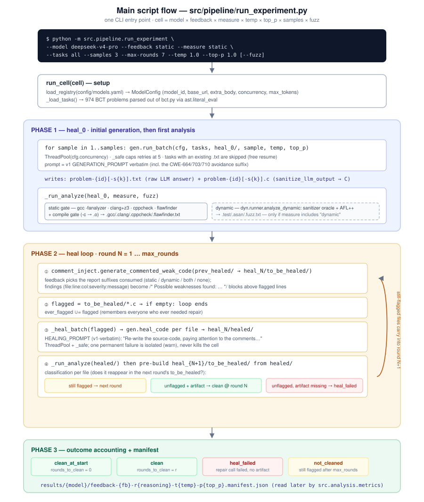
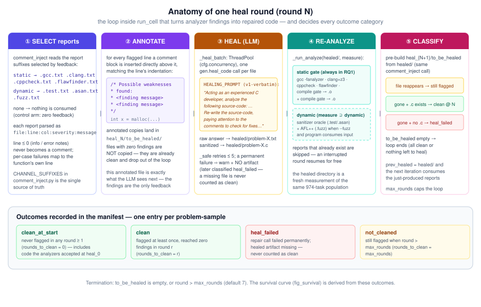
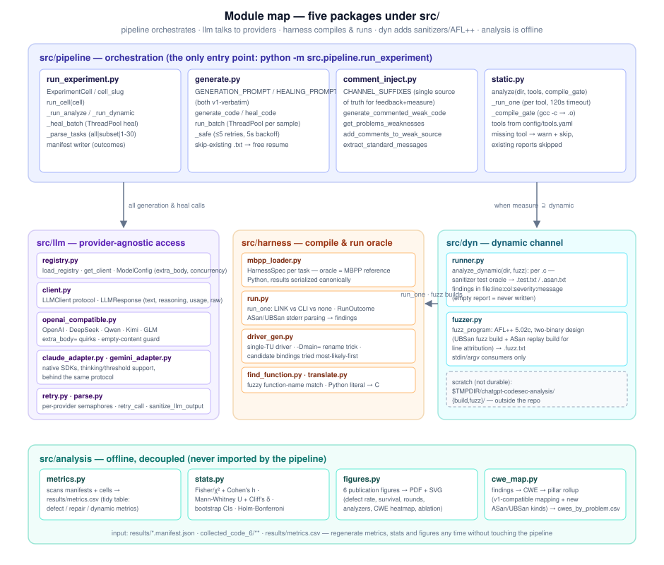

# Experiment Pipeline Architecture — FSE 2027 Extension

**Repo:** `chatgpt-codesec-analysis` (BCT dataset, 974 C programming tasks)
**Successor of:** the ISE 2026 v1 pipeline (`run_full_experiment.py`, kept untouched for reproduction)
**Document date:** 2026-09-01

This document explains, in depth, how the new experiment works: the main script's flow, the anatomy of the healing loop, what every module does, where every artifact lands on disk, and the design decisions behind it. The three figures referenced below are the same diagrams shown in the chat, each followed by a full textual explanation of everything it depicts.

---

## Table of contents

1. [What this pipeline does](#1-what-this-pipeline-does)
2. [The unit of execution: the cell](#2-the-unit-of-execution-the-cell)
3. [Main script flow (Figure 1)](#3-main-script-flow)
4. [The heal loop, round by round (Figure 3)](#4-the-heal-loop-round-by-round)
5. [Module map (Figure 2)](#5-module-map)
6. [Data on disk](#6-data-on-disk)
7. [Cross-cutting design decisions](#7-cross-cutting-design-decisions)
8. [Running it](#8-running-it)
9. [Reading the first results through the architecture](#9-reading-the-first-results-through-the-architecture)

---

## 1. What this pipeline does

The experiment answers the FSE 2027 research questions by letting 7 LLMs (each in a base and a *thinking* variant) write C code for the 974 BCT tasks, measuring how defective that code is, and then measuring how well the models repair their own defects when given analyzer feedback.

One pass over a task works like this:

1. **Generate.** The model produces a complete C program (with `main`) for the task text, zero-shot. The prompt is **byte-identical to v1** (including the "Avoid CWE-664/703/710" suffix) so numbers stay comparable with the ISE 2026 paper.
2. **Measure.** A multi-analyzer gate inspects the generated code:
   - **static channel** — GCC `-fanalyzer`, Clang static analyzer (+Z3), Cppcheck Premium, Flawfinder, plus a plain compile gate;
   - **dynamic channel** — an ASan+UBSan test oracle that actually compiles and runs the program against MBPP-derived test cases, and (optionally) AFL++ fuzzing.
3. **Heal.** Every finding is injected into the source as a `/* Possible weaknesses found: ... */` comment, and the model is asked to rewrite the code paying attention to the comments — again with a v1-verbatim prompt.
4. **Repeat.** Steps 2–3 loop until no findings remain or `max_rounds` (default 7) is exhausted. Every problem-sample ends in exactly one of four outcomes: `clean_at_start`, `clean`, `heal_failed`, `not_cleaned`.

What is *new* relative to v1: the multi-provider model registry (including reasoning variants), the dynamic sanitizer oracle + AFL++ fuzzing channel, the orthogonal `measure`/`feedback` knobs, the statistical analysis suite (Fisher/χ², Mann–Whitney U, bootstrap CIs, Holm–Bonferroni), and a crash-resumable, file-based execution model.

---

## 2. The unit of execution: the cell

Everything the pipeline runs is a **cell**, defined by the `ExperimentCell` dataclass in `src/pipeline/run_experiment.py`:

| Field | Meaning | Typical RQ1 value |
|---|---|---|
| `model` | registry id in `config/models.yaml` | `deepseek-v4-pro` |
| `feedback` | which findings are injected as healing comments: `none`/`static`/`dynamic`/`static+dynamic` | `static` |
| `measure` | which detection channels **run** and produce the paper's numbers: `static`/`dynamic`/`static+dynamic` | `static` |
| `tasks` | task ids (`all` = 1–974, `subset` = the 200-task vulnerable subset, or `1-30` ranges) | `all` |
| `samples` | independent samples per task (temperature-driven diversity) | 3 |
| `temp` / `top_p` | sampling parameters | 1.0 / 1.0 |
| `max_rounds` | healing round cap | 7 |
| `fuzz` | enable the AFL++ channel (costly; stdin/argv consumers only) | off in RQ1 |

The cell's directory name is the **slug**:

```
cell_slug = feedback-{feedback}-r{reasoning}-t{temp}-p{top_p}
```

e.g. `feedback-static-r0-t1.0-p1.0`. Note carefully what the slug does **not** encode: `measure`, `samples`, `tasks`, and `fuzz`. This is deliberate (slug = the knobs v1's foldering had) but has a sharp edge we already hit once: if you run a 30-task validation cell and later a full sweep with the *same* slug but a *different* `measure`, both write into the same directory and pollute each other's metrics. That is why the `validate30` cell now lives in `archive/validation-cells/` with only its manifest copied to `results/deepseek-v4-pro/validate30.manifest.json`.

### `measure` vs `feedback` — the key orthogonality

These two knobs are the heart of the extension's experiment design, and they are independent:

- **`measure`** decides *which analyzers run* on every source (round 0 and every healed round). The paper's defect rates and survival curves are computed **only** from the channels selected here. RQ1 uses `measure=static` so the numbers are directly comparable to v1; `static+dynamic` cells are the RQ2/ablation cells.
- **`feedback`** decides *which of the produced reports are consumed* by `comment_inject` and turned into healing comments. It can be a strict subset of what was measured (e.g. measure static+dynamic, feedback static — "does the model benefit from dynamic findings without us measuring dynamically?").

Both knobs are fed from one shared definition of report suffixes (`CHANNEL_SUFFIXES` in `comment_inject.py`) — a single source of truth, so a report can only be injected if the corresponding analyzer actually ran.

The CLI derives `measure` from `feedback` when you don't pass it explicitly: `measure = feedback`, except `feedback=none` or `dynamic` default to `measure=static+dynamic` (the control arm still needs full detection to score outcomes).

---

## 3. Main script flow



**Figure 1** shows the entire lifecycle of one cell invocation. In text:

### 3.1 Command line

There is exactly one entry point:

```bash
python -m src.pipeline.run_experiment \
    --model deepseek-v4-pro \        # registry id from config/models.yaml
    --feedback static \              # none | static | dynamic | static+dynamic
    --measure static \               # static | dynamic | static+dynamic (default: derived)
    --tasks all \                    # all | subset | comma list / inclusive ranges (1-30)
    --samples 3 \                    # independent samples per task
    --max-rounds 7 \
    --temp 1.0 --top-p 1.0 \         # sampling grid (ablations)
    [--fuzz]                         # AFL++ channel on (stdin/argv consumers only)
```

`__main__` parses this into an `ExperimentCell` and calls `run_cell(cell)`. Task parsing (`_parse_tasks`) accepts `all` (1–974), `subset` (reads `results/vulnerable_subset.csv` — the 200-task ablation subset), or explicit ids/ranges.

### 3.2 Setup (top white box)

`run_cell` first does two lookups:

- `load_registry("config/models.yaml")` → the `ModelConfig` for the model id. This carries everything the LLM layer needs: provider, real API `model_id`, `base_url`, `api_key_env`, `max_tokens`, `concurrency`, and `extra_body` (provider-specific toggles like DeepSeek's `thinking: {type: disabled}` — these are applied on *both* reasoning and non-reasoning paths).
- `_load_tasks()` → the 974 BCT problems. Tasks live in `bct.py` as a giant Python literal; the loader `ast.parse`s the file and `ast.literal_eval`s the `problems` list (no import side effects).

### 3.3 Phase 1 — `heal_0`: initial generation + first analysis (blue container)

For each sample `1..samples`, `gen.run_batch` fans out one `generate_code` call per task through a `ThreadPoolExecutor(cfg.concurrency)`. Each call:

1. checks whether `problem-{id}[-s{k}].txt` already exists — **if so it returns immediately** (this is the resume mechanism; a killed sweep restarts with zero duplicated API calls);
2. sends the v1-verbatim `GENERATION_PROMPT`;
3. writes the raw answer to `.txt` **and immediately the sanitized code to `.c`** (`sanitize_llm_output` strips markdown fences and trailing prose).

Sample suffixes: sample 1 has none (`problem-5.c`), samples 2+ get `-s2`, `-s3`, … (`problem-5-s2.c`). Every report file later shares this basename.

Then `_run_analyze(heal_0, measure, fuzz)` runs the detection channels for the first time:

- **static gate** (solid chip in the figure) — `static.analyze` runs all four tools over every `.c` with 120 s per (file, tool) timeout, plus a compile gate (`gcc -c` → `.o`) that records compilability. Writes `.gcc.txt`, `.clang.txt`, `.cppcheck.txt`, `.flawfinder.txt` (reports are only meaningful in the shared `file:line:col:severity:message` format; a missing tool or an existing report is skipped, never an error).
- **dynamic channel** (dashed chip) — only if `measure` includes `dynamic`: `dyn.runner.analyze_dynamic` compiles each program under ASan+UBSan, runs the test oracle, and optionally fuzzes. Writes `.test.txt`, `.asan.txt`, `.fuzz.txt`.

### 3.4 Phase 2 — the heal loop (amber container)

Rounds `1..max_rounds`, each round = four steps (①–④ in the figure): inject comments → collect the flagged set → heal with the LLM → re-analyze and classify. The full anatomy is §4. The curved arrow on the right of the figure is the loop edge: files that are still flagged after round N carry into round N+1 with `prev_healed = healed/`.

### 3.5 Phase 3 — outcome accounting + manifest (green container)

After the loop ends (empty `to_be_healed` or round cap), every problem-sample that never got an outcome during the loop is classified:

- never flagged in any round → **`clean_at_start`** (`rounds_to_clean = 0`);
- flagged at least once and never reached zero → **`not_cleaned`** (`rounds_to_clean = max_rounds`).

Together with the in-loop outcomes (`clean`, `heal_failed`), the full outcome map is written to:

```
results/{model}/feedback-{fb}-r{reasoning}-t{temp}-p{top_p}.manifest.json
```

The manifest holds the complete cell config plus one entry per problem-sample. It is the *only* input the analysis suite needs for outcome metrics — `src.analysis.metrics` never looks at the raw directory tree for outcomes.

---

## 4. The heal loop, round by round



**Figure 3** dissects round N into five steps. This is the heart of the experiment — everything the paper reports about repair behavior is decided here.

### ① SELECT reports

`comment_inject.generate_commented_weak_code` starts from the previous round's source directory (`prev_healed`) and reads the report suffixes that the cell's `feedback` selects:

| `feedback` | suffixes consumed |
|---|---|
| `none` | nothing (control arm — the model is asked to "repair" with no findings) |
| `static` | `.gcc.txt`, `.clang.txt`, `.cppcheck.txt`, `.flawfinder.txt` |
| `dynamic` | `.test.txt`, `.asan.txt`, `.fuzz.txt` |
| `static+dynamic` | all seven |

Each report is parsed line-by-line as `file:line:col:severity:message`. Lines with `line ≤ 0` (info notes like "all 30 test cases passed" or errors like "could not compile under sanitizers") are **never** comment targets; per-case test failures are attributed to the target function's own line so they still become actionable comments.

### ② ANNOTATE

For every flagged line, a comment block is inserted *directly above it*, matching the line's indentation:

```c
    /* Possible weaknesses found:
     * memory leak: malloc without free
     */
    int *p = malloc(n * sizeof(int));
```

Annotated copies are written to `heal_N/to_be_healed/`. Files with **zero findings are not copied** — they are already clean and simply drop out of the loop. This annotated file is the *only* feedback the model ever sees: no chat history, no scores, just findings pinned to lines.

### ③ HEAL (LLM)

`_heal_batch` fans the flagged files out through a thread pool, one `gen.heal_code` call each, using the v1-verbatim `HEALING_PROMPT` ("Re-write the source-code, paying attention to the comments to check for fixes for the possible weaknesses identified…"). Two artifacts per file land in `heal_N/healed/`: the raw answer (`.txt`) and the sanitized code (`.c`).

Reliability wraps: `_safe` retries any call up to 5 times with 5 s backoff; a *permanent* failure (after 5 attempts) is logged as a warning and the file simply has **no artifact** — one bad task can never kill the cell. The client layer additionally raises on **empty completions** (reasoning-only or truncated responses), which would otherwise sanitize to an empty `.c` file and sail through every analyzer as "clean".

### ④ RE-ANALYZE

`_run_analyze(healed/, measure)` runs exactly the same detection stack as Phase 1 over the repaired code. Reports that already exist are skipped (resume-friendly — an interrupted round costs nothing to redo).

### ⑤ CLASSIFY

The subtle step: to know whether a healed file is *still* defective, the pipeline **pre-builds the next round's `to_be_healed`** by running the same comment-injection call over `healed/`. Then, for each file that was flagged this round:

- it **reappears** in `heal_{N+1}/to_be_healed` → still flagged → it continues into the next round;
- it's **gone and its `.c` exists** → outcome `clean` with `rounds_to_clean = N`;
- it's **gone and there is no `.c`** → the heal call failed permanently → outcome `heal_failed` (never counted as clean — this is the guard against the empty-artifact hazard).

This "the next round's input doubles as this round's verdict" trick is why the loop needs no database: the directory tree *is* the state.

### Outcome summary (bottom band of the figure)

| Outcome | Definition | `rounds_to_clean` |
|---|---|---|
| `clean_at_start` | never flagged in any round ≥ 1 | 0 |
| `clean` | flagged at least once, reached zero findings in round r | r |
| `heal_failed` | repair call failed permanently; artifact missing | the round it failed in |
| `not_cleaned` | still flagged when round > `max_rounds` | `max_rounds` |

**Termination:** `to_be_healed` is empty (nothing left to heal) or round > `max_rounds` (default 7). The survival curve in `fig_survival` (fraction still flagged per round) is derived entirely from these outcomes.

---

## 5. Module map



**Figure 2** shows the five packages under `src/` and their key functions. Call dependencies flow strictly downward: `pipeline` is the only orchestrator; it calls `llm` for every model interaction and `dyn` for the dynamic channel; `dyn` delegates the actual compile-and-run work to `harness`; `analysis` is fully decoupled and only reads files.

### 5.1 `src/pipeline` — orchestration (indigo, top)

The only package you invoke directly.

| Module | Responsibility | Key functions |
|---|---|---|
| `run_experiment.py` | CLI, cell definition, the three phases, manifest writing | `ExperimentCell`, `cell_slug`, `run_cell`, `_run_analyze`, `_run_dynamic`, `_heal_batch`, `_parse_tasks` |
| `generate.py` | LLM code generation and repair with v1-verbatim prompts; batching and retry policy | `generate_code`, `heal_code`, `run_batch`, `_safe` |
| `comment_inject.py` | Turns analyzer reports into source comments; **owns the channel/suffix vocabulary** shared by `feedback` and `measure` | `CHANNEL_SUFFIXES`, `generate_commented_weak_code`, `get_problems_weaknesses`, `add_comments_to_weak_source`, `extract_standard_messages` |
| `static.py` | The 4-tool static gate + compile gate, driven by `config/tools.yaml` | `analyze`, `_run_one`, `_compile_gate` |

### 5.2 `src/llm` — provider-agnostic model access (purple, left)

The rest of the pipeline never knows which provider it is talking to.

| Module | Responsibility |
|---|---|
| `registry.py` | Loads `config/models.yaml` into `ModelConfig` objects; `get_client` picks the right client class. Also registers per-provider concurrency semaphores. |
| `client.py` | The `LLMClient` protocol every adapter implements, and the normalized `LLMResponse` (text, optional reasoning trace, usage, raw response for audit). |
| `openai_compatible.py` | One client for OpenAI, DeepSeek, Qwen/DashScope, Kimi/Moonshot, GLM/Zhipu (all speak `/chat/completions`). Provider quirks go through the SDK's `extra_body=` parameter (unknown kwargs raise `TypeError`); hard guard: an **empty completion raises** instead of returning "" (empty `.c` files would pass every analyzer). |
| `claude_adapter.py` / `gemini_adapter.py` | Native-SDK clients for Anthropic and Google behind the same protocol, with thinking support. |
| `retry.py` | Per-provider semaphores, transient-error retries with backoff, cost-cap guards — shared by all clients. |
| `parse.py` | `sanitize_llm_output`: extract compilable C from a raw answer (strip ``` fences, handle fence-less answers, drop trailing prose). |

Reasoning ("thinking") is modeled as a **variant selector**, not a flag: a thinking model is a separate registry entry (e.g. `deepseek-v4-pro` vs `deepseek-v4-pro-thinking`) with its own `max_tokens` and `extra_body`, because that is how the providers actually expose it.

### 5.3 `src/harness` — compile & run oracle (amber, middle)

The execution engine behind the dynamic channel.

| Module | Responsibility |
|---|---|
| `mbpp_loader.py` | Builds a `HarnessSpec` per task from the MBPP record: candidate function names, canonicalized test cases. The oracle is the **reference Python implementation** — expected outputs are computed by executing it, then serialized canonically. No Python→C translation of the oracle is needed; the C side just has to produce the same serialization. |
| `run.py` | `run_one(source, spec)` — the single compile-and-run entry point. Picks a testable interface: **LINK** (a fuzzy-matched target function exists → append a generated driver, compile as one translation unit, run, compare against the oracle) or **CLI** (program reads stdin/argv → compile as-is with sanitizers, run with a trivial input, catch startup crashes) or **none**. Returns a `RunOutcome` (mode, compiled, matched, ASan/UBSan findings, per-case failures). |
| `driver_gen.py` | Generates the C driver: the LLM's `main` is renamed away with `-Dmain=__mbpp_disabled_main` so the real function definition is what the compiler sees; wrong call bindings fail at compile time (cheap) instead of silently producing garbage. Candidate bindings (out-length pointer vs. `char **`, etc.) are tried most-likely-first. |
| `find_function.py` | Fuzzy-matches the function-under-test (LLM naming drift like `extract_string` → `extractStrings`). |
| `translate.py` | Renders Python literals (int/float/str/bool, 1-D/2-D homogeneous lists) as C initializers for the driver. |

### 5.4 `src/dyn` — the dynamic channel (teal, right)

| Module | Responsibility |
|---|---|
| `runner.py` | `analyze_dynamic(dir, fuzz)`: per `.c` — look up the task's `HarnessSpec`, call `harness.run_one`, and write `.test.txt` (functional pass/fail) and `.asan.txt` (ASan+UBSan findings in the standard format). Empty reports are never written: **absence of a file = clean**. |
| `fuzzer.py` | `fuzz_program`: AFL++ 5.02c wrapper with the **two-binary design** — the fuzz binary is built with `afl-clang-fast` + UBSan only (ASan-instrumented AFL builds are unstable on this host), while a second ASan+UBSan replay binary attributes crashes to source lines. Only stdin/argv-consuming programs are fuzzed; function-only programs are covered by the sanitizer oracle instead. |

All build scratch lives in `$TMPDIR/chatgpt-codesec-analysis/{build,fuzz}/` — deliberately **outside the repo** (see §7.6).

### 5.5 `src/analysis` — offline, decoupled (green, bottom)

Never imported by the pipeline; reads only `results/` and `collected_code_6/`. This means metrics, statistics and figures can be regenerated at any time without touching (or risking) a running sweep.

| Module | Responsibility |
|---|---|
| `metrics.py` | Scans every cell manifest + directory → tidy `results/metrics.csv`: generation metrics (n, compilable), defect metrics (initial flagged rate, per-tool), repair metrics (outcome shares, mean/median rounds-to-clean), dynamic metrics when present. |
| `stats.py` | The paper's tests: Fisher exact / χ² + Cohen's *h* for rate contrasts; Mann–Whitney U + Cliff's δ for rounds-to-clean; bootstrap 95% CIs; Holm–Bonferroni correction over the model family. Emits `results/stats_report.md` (per-model summary always; pairwise contrasts need ≥ 2 models). |
| `figures.py` | Six publication figures to PDF + SVG: defect rate (bootstrap CI), survival across rounds, rounds-to-clean distribution, analyzer stacked bar, CWE heatmap, feedback-ablation contrast. |
| `cwe_map.py` | Maps findings → CWE → pillar rollup (v1's token mapping kept verbatim, extended with ASan/UBSan error kinds) → `results/cwes_by_problem.csv`. |

---

## 6. Data on disk

```
chatgpt-codesec-analysis/
├── bct.py                                  # the 974 tasks (Python literal)
├── mbpp/mbpp.jsonl                         # MBPP records (oracle source)
├── harnesses/<task_id>/spec.json           # per-task HarnessSpec (built once)
├── config/
│   ├── models.yaml                         # model registry (pinned 2026-08-31)
│   ├── experiment.yaml                     # RQ1 model list, sampling grids, subset size
│   └── tools.yaml                          # analyzer paths/flags + dynamic timeouts
├── collected_code_6/                       # ALL durable artifacts
│   └── {model}/
│       └── {cell_slug}/                    # e.g. feedback-static-r0-t1.0-p1.0
│           ├── heal_0/                     # initial generation
│           │   ├── problem-5.c             #   sanitized code
│           │   ├── problem-5.txt           #   raw LLM answer
│           │   ├── problem-5-s2.c          #   sample 2, etc.
│           │   ├── problem-5.gcc.txt       #   static reports (4 tools)
│           │   ├── problem-5.o             #   compile gate artifact
│           │   ├── problem-5.test.txt      #   dynamic: oracle pass/fail
│           │   ├── problem-5.asan.txt      #   dynamic: sanitizer findings
│           │   └── problem-5.fuzz.txt      #   dynamic: AFL++ findings
│           ├── heal_1/
│           │   ├── to_be_healed/           #   annotated (commented) sources
│           │   └── healed/                 #   repairs + their reports
│           └── heal_N/...                  #   one pair per round
├── results/
│   ├── {model}/{cell_slug}.manifest.json   # outcome per problem-sample
│   ├── metrics.csv                         # tidy table (metrics.py)
│   ├── stats_report.md                     # significance tests (stats.py)
│   ├── cwes_by_problem.csv                 # CWE mapping (cwe_map.py)
│   ├── figures/                            # PDF + SVG (figures.py)
│   └── vulnerable_subset.csv               # 200-task ablation subset
├── artifacts/                              # PERMANENT dynamic-analysis archives
│   └── collected_code_6/{model}/{cell}/heal_N/{to_be_healed,healed}/
│       └── problem-X/
│           ├── build/                      #   sanitizer builds: combined_N.c
│           │                               #   drivers, ASan/UBSan binaries
│           └── fuzz/                       #   full AFL++ session: fuzz +
│                                           #   replay binaries, seeds/, out/
│                                           #   (queue, crashes, fuzzer_stats,
│                                           #   plot_data)
└── archive/validation-cells/               # retired cells (kept out of metrics scans)
```

Report suffix cheat sheet (one basename, seven possible reports):

| Suffix | Channel | Tool | Written when |
|---|---|---|---|
| `.gcc.txt` | static | gcc -fanalyzer | findings only |
| `.clang.txt` | static | clang --analyze + z3 | findings only |
| `.cppcheck.txt` | static | Cppcheck Premium | findings only |
| `.flawfinder.txt` | static | Flawfinder | findings only |
| `.o` | static | compile gate | compilable code only |
| `.test.txt` | dynamic | test oracle | always (info/error/pass/fail) |
| `.asan.txt` | dynamic | ASan + UBSan | findings only |
| `.fuzz.txt` | dynamic | AFL++ | findings only |

Scratch (not durable, wiped by reboot): sanitizer builds and AFL++ sessions in `$TMPDIR/chatgpt-codesec-analysis/{build,fuzz}/`.

---

## 7. Cross-cutting design decisions

**7.1 Prompt parity with v1.** Both prompts are copied verbatim from v1's `collect_code.py`. Any wording change would break comparability with the ISE 2026 numbers — healing behavior is highly sensitive to prompt phrasing.

**7.2 File-based state, not a database.** There is no checkpoint file and no in-memory state that matters. `generate` skips existing `.txt`s; `static.analyze` skips existing reports; `comment_inject` skips existing annotated copies; outcomes are recomputed from the directory tree at manifest time. Consequence: an interrupted sweep (host reboot, API outage) resumes with **zero duplicated API calls** — verified in practice when both RQ1 sweeps were killed overnight and relaunched for free.

**7.3 Failure isolation everywhere.** Three nested guards: the client raises on empty content; `_safe` retries ≤ 5 times; the batch runners catch permanent per-task failures and continue. A single poisoned task degrades to a `heal_failed` outcome, never a crashed cell.

**7.4 `heal_failed` honesty.** A missing repaired artifact is recorded as `heal_failed`, never as clean — because an empty/missing `.c` would trivially "pass" all analyzers. (This outcome also lets us detect API outages post-hoc: e.g. the 2026-09-01 DeepSeek balance exhaustion shows up as exactly 109 `heal_failed` entries in rounds 6–7, cleanly separable from genuine repair failure.)

**7.5 Reasoning variants as registry entries.** Thinking mode changes the API contract (reasoning tokens, higher `max_tokens`, provider-specific toggles), so each thinking variant is its own registry row with its own `extra_body` — the pipeline code stays identical.

**7.6 Scratch outside the repo, archives inside.** Sanitizer builds and AFL++ sessions produce/delete hundreds of scratch files per round; on this host, bulk deletes inside project paths are killed by a sandbox guard. Hence the *working* scratch (`BUILD_ROOT`/`FUZZ_ROOT`) lives under `$TMPDIR` — but since 2026-09-01 every completed run is also **copied** into a permanent `artifacts/` tree in the repo (`archive_scratch()` in `harness/run.py`): sanitizer builds under `build/`, full AFL++ sessions under `fuzz/` (queue, crash inputs, `fuzzer_stats`, both binaries). The copy is merge-only (`dirs_exist_ok=True`) — the pipeline never deletes anything under `artifacts/`, so the guard can never trigger there — and re-runs of the same source keep a union of all sessions. Archives are keyed by the source's repo-relative path, so they never collide and are trivially mappable back to the code they came from. `DYN_ARCHIVE=none` disables archival for throwaway dry-runs; `DYN_ARCHIVE_ROOT` relocates the tree. Note the analysis layer never *reads* the archives (the `.test/.asan/.fuzz.txt` reports in `collected_code_6` remain the single input to metrics) — they exist for post-hoc inspection, crash reproduction, and corpus mining. Also note `os.makedirs(exist_ok=True)` is used everywhere because the brokered `os.mkdir` shim raises `PermissionError` on existing paths.

**7.7 Toolchain pins (macOS, Intel).** ASan runtime only works via Apple's `/usr/bin/clang` (Homebrew LLVM 21's is broken on macOS 26.5); UBSan works on both. AFL++ 5.02c must be built `TEST_MMAP=1` (SysV shmget fails with EINVAL). Sanitizer set is overridable via `DYN_SANITIZERS` without code changes.

---

## 8. Running it

```bash
# RQ1 main sweep for one model (974 tasks × 3 samples, static measure — v1-comparable)
.venv/bin/python -m src.pipeline.run_experiment \
    --model deepseek-v4-pro --feedback static --measure static \
    --tasks all --samples 3 --max-rounds 7

# Quick dry-run (1 task, all intermediate files inspectable)
.venv/bin/python -m src.pipeline.run_experiment --model qwen-max \
    --feedback static+dynamic --measure static+dynamic --tasks 2

# Ablation cell on the 200-task vulnerable subset
.venv/bin/python -m src.pipeline.run_experiment --model glm-5.1 \
    --feedback static+dynamic --measure static+dynamic --tasks subset --samples 2

# Regenerate the analysis layer (safe while sweeps run)
.venv/bin/python -m src.analysis.metrics      # -> results/metrics.csv
.venv/bin/python -m src.analysis.stats        # -> results/stats_report.md
.venv/bin/python -m src.analysis.cwe_map      # -> results/cwes_by_problem.csv
.venv/bin/python -m src.analysis.figures      # -> results/figures/
```

### Status at document time (2026-09-01, updated after both sweeps landed)

- **deepseek-v4-pro RQ1 sweep: complete.** Caveat: the DeepSeek API balance ran out during heal round 6 — 109/2922 samples are `heal_failed` (26 in round 6, all 83 of round 7). Once the balance is topped up, re-running the identical command resumes only those 109 heals (everything else is skip-existing) and rewrites the manifest. **Do not quote the current deepseek manifest as final.**
- **qwen-max RQ1 sweep: complete and clean** (exit 0, zero `heal_failed`) — first fully trustworthy RQ1 cell.
- Remaining 5 models: blocked on API keys (Anthropic, Gemini, Moonshot, Zhipu) and the OpenAI proxy; registry pins for all 7 were re-verified and updated on 2026-08-31.

---

## 9. Reading the first results through the architecture

The first two sweeps are a good exercise in connecting the machinery above to the numbers it produces. All figures below come from `results/metrics.csv` (regenerated 2026-09-01 after both sweeps finished; per-sample raw data in the two manifests).

| Metric (column) | deepseek-v4-pro | qwen-max | What pipeline stage decides it |
|---|---|---|---|
| `n_generated` | 2922 | 2922 | Phase 1 generation: 974 tasks × 3 samples, all delivered |
| `n_compilable` / `compile_rate` | 2862 / 97.95% | 2743 / 93.87% | The plain compile gate in `static.analyze` |
| `flagged_gcc` / `flagged_clang` | 60 / 71 | 179 / 176 | GCC `-fanalyzer` and Clang SA reports present in heal_0 |
| `flagged_cppcheck` | 968 | 1007 | Cppcheck Premium reports (the dominant static detector) |
| `initial_flagged` / `initial_defect_rate` | 1006 / **34.4%** | 1118 / **38.3%** | Union of all static findings in round 0 — the paper's "initial defect rate" |
| `clean_at_start` | 1916 | 1804 | Heal-loop entry: zero findings → never enters the loop |
| `cleaned` | 897 | 1078 | Healed to zero findings within ≤7 rounds |
| `not_cleaned` | 0 | 40 | Still flagged after round 7 |
| `heal_failed` | **109** | 0 | Missing healed artifact (here: API 402 outage in rounds 6–7, not a model failure) |
| `mean_rounds_to_clean` | 1.31 | 1.22 | Averaged over healed samples — how fast feedback converges |
| `final_clean_rate` | 1.0000* | 0.9863 | (clean_at_start + cleaned) / (total − heal_failed); *deepseek's 1.0 is an artifact of excluding the outage victims — see below |

**The `survival_counts` column is the heal loop in miniature.** For qwen-max:

```
round 0: 1118 flagged  →  round 1: 1118  →  198  →  74  →  60  →  54  →  47  →  43  →  40
```

That is exactly Figure 3's step-5 classification, counted: 920 of 1118 flagged samples (82%) are fixed by a *single* round of static feedback — the comment injection + re-generation loop is highly effective on first contact. The remainder decays slowly (198 → 40 over six more rounds); the last ~3.5% are the hard residue where the model either cannot interpret the finding or keeps re-introducing the same pattern, which is precisely the population the RQ2 dynamic-feedback cells will target.

**Why deepseek's `final_clean_rate = 1.0` must not be quoted.** The rate excludes `heal_failed` from the denominator (correct for genuine heal crashes, designed so API noise never inflates *defect* numbers), but here the 109 exclusions are outage victims that were mostly on their way to being cleaned (they survived to rounds 6–7 of healing, meaning earlier rounds had succeeded). After the balance top-up and the free resume-run, the manifest will be rewritten and this number becomes meaningful.

**Two cross-model observations already possible:**

1. **qwen-max writes buggier initial code but heals almost as well** — 38.3% vs 34.4% initial defect rate, yet mean rounds-to-clean differ by only 0.09. Defect *introduction* and defect *repair-under-feedback* are visibly independent skills, which is the extension's core claim territory (v1 could not separate them).
2. **Cppcheck dominates detection volume** (~968/1006 and 1007/1118 of flagged samples carry a Cppcheck finding) while gcc/clang-SA each flag only a few percent — an argument for keeping the multi-analyzer union gate rather than any single tool, and a caveat for CWE attribution (the `cwes_by_problem.csv` roll-up inherits Cppcheck's finding taxonomy).

Once the remaining 5 keys arrive, the same two rows extend to seven models, and `stats_report.md` (Fisher exact tests, Cohen's h, Holm–Bonferroni) starts producing the pairwise contrasts the paper needs.
